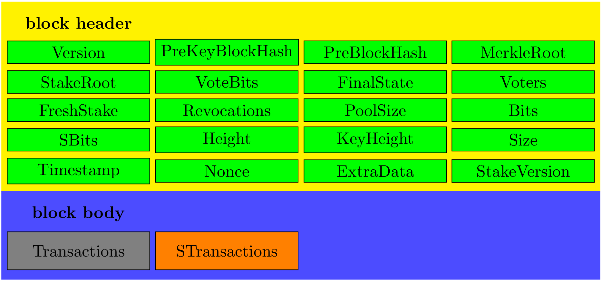

# Mining
While working on some PoW, `hcashd` actually tries to build a block out of a prepared `BlockTemplate` consisting of

+ `Block`: block header + plain txs + stake txs
+ `Fee`: tx fees vector paid by each tx in `Block`   
+ `SigOpCounts`: TBC   
+ `Height`: block height of current block   
+ `KeyHeight`: number of key blocks before current block   
+ `ValidPayAddress`: TBC   
+ `GenerateKey`: TBC    

## `Block`  
The structure of `Block` go as follows figure   
   

## Unit Tests  
Work on progress  
+ [x] tx priority queue in `mining_test.go`  
